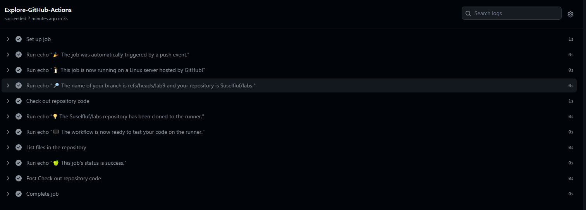

# CI/CD Lab - GitHub Actions

## Task 1: Create your First GitHub Actions Pipeline

1. Initially I have created .github\workflows\main.yml file to configure my test pipeline with respect to provided buide:

```
name: GitHub Actions Demo
run-name: ${{ github.actor }} is testing out GitHub Actions 🚀
on: [push]
jobs:
  Explore-GitHub-Actions:
    runs-on: ubuntu-latest
    steps:
      - run: echo "🎉 The job was automatically triggered by a ${{ github.event_name }} event."
      - run: echo "🐧 This job is now running on a ${{ runner.os }} server hosted by GitHub!"
      - run: echo "🔎 The name of your branch is ${{ github.ref }} and your repository is ${{ github.repository }}."
      - name: Check out repository code
        uses: actions/checkout@v3
      - run: echo "💡 The ${{ github.repository }} repository has been cloned to the runner."
      - run: echo "🖥️ The workflow is now ready to test your code on the runner."
      - name: List files in the repository
        run: |
          ls ${{ github.workspace }}
      - run: echo "🍏 This job's status is ${{ job.status }}."

```

2. Then i have pushed changes to my github repo and run the pipline within the Actions folder, where that was possible to obtain follwing result:
   

### Key concepts

**Workflows** are automated processes that are defined in YAML files called workflow files. It includes a number of jobs that can either execute concurrently or sequentially. Each task may involve several steps.

Workflows can be started by a variety of actions, including submitting code, making a pull request, or scheduling runs via **Trigering Workflow**

A workflow may have one or more **jobs**. Jobs are autonomous work-producing entities. They often stand for independent steps in a CI/CD pipeline.

**Workflow File**: A workflow file, such as main.yml, is stored in a repository's.github/workflows directory.

**Steps:** Every work that is performed as part of a job is divided into one or more steps.

**Actions**: Workflows can be created by combining reusable chunks of code called actions. There are numerous pre-built actions available on GitHub, and you may even design your own.

Workflows are executed on either self-hosted or GitHub-hosted **runners**. Self-hosted runners use an infrastructure, but GitHub-hosted runners use virtual machines that GitHub provides.

**Workflow Syntax**: To define tasks, steps, and actions, the workflow file uses a special syntax that is written in YAML.

### Observations

After i have submitted my yml file, github repository automatically updated Actions folder with corresponding workflow, where it is possible to see the result of the workflow on specific triggers.
On test run I have not obtained any errors, howerver I have experienced obtaining errors within the workflow before, that will be highlighted with corresponding icon on the workflow folder and will spot the error in logs.

## Task 2: Gathering System Information and Manual Triggering

1. Configure a Manual Trigger:
   I have configured freshly created workflow manual_pipelnine.yml with respect to following [source](https://dev.to/this-is-learning/manually-trigger-a-github-action-with-workflowdispatch-3mga).

   So my code was follwoing:

   ```
   name: Manual trigger
   on:
   workflow_dispatch:
    inputs:
      name:
        description: "Who to greet"
        default: "World"

    jobs:
    hello:
    runs-on: ubuntu-latest

            steps:
            - name: Hello Step
                run: echo "Hello ${{ github.event.inputs.name }}"
   ```

2. Gather System Information:
